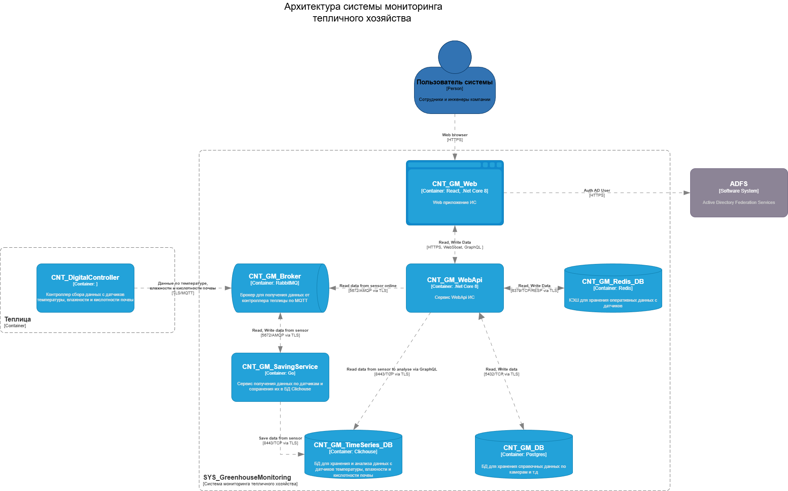
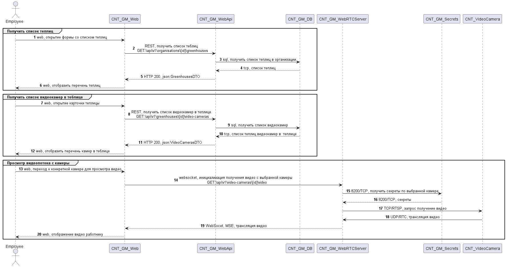

# Архитектура системы мониторинга тепличного хозяйства

## 1. Диаграммы в нотации С4 Level 2 Container diagram

На диаграмме представлена архитектура системы мониторинга тепличного хозяйства

Система состоит из следующих компонентов:

|№|Название|Назначение компонента|
|-|--------|---|
|1|CNT_GM_Web|Web приложение|
|2|CNT_GM_WebApi|Сервис WebApi ИС|
|3|CNT_GM_Redis_DB|КЭШ для хранения оперативных данных с датчиков|
|4|CNT_GM_DB|БД для хранения справочных данных по камерам и т.д|
|5|CNT_GM_TimeSeries_DB|БД для хранения и анализа данных с датчиков температуры, влажности и кислотности почвы|
|6|CNT_GM_SavingService|Сервис получения данных по датчикам и сохранения их в БД Clichouse|
|7|CNT_GM_Broker|Брокер для получения данных от контроллера теплицы по MQTT|
|8|CNT_GM_WebRTCServer|Сервис получения видеоконтента с камер в теплицах|
|9|CNT_GM_Secrets|Сервис хранение секретов|

## 2. Диаграммы последовательностей

Предполается два варианта использования

### 2.1 Просмотр видео и данных с датчиков в реальном времени

## 3. Диаграмма развертывания

## 4. ER диаграмма

